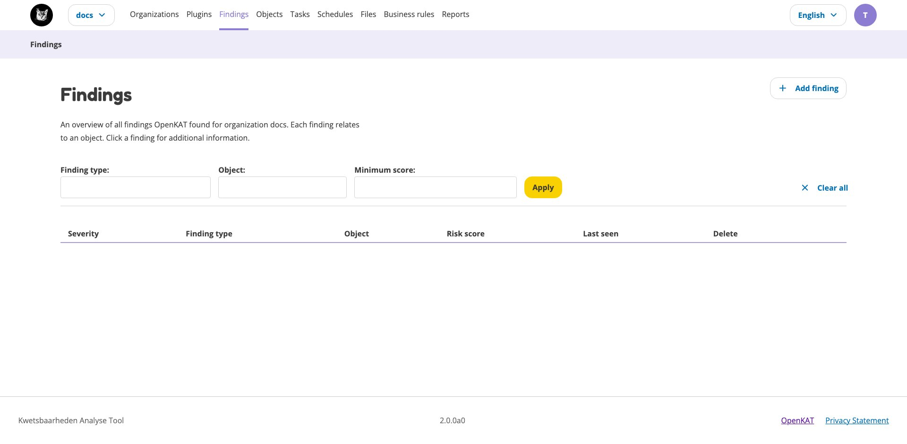

Findings
========

The findings page gives an overview of all findings found by OpenKAT.
The filter section can be used to apply various filters to show specific findings (e.g. critical findings only) and/or hosts.
The search bar can be used to search for specific findings or hosts. Clicking on a finding shows more information on this finding.
Each finding can be viewed in the tree or graph by clicking the corresponding icons behind the finding.

A finding is also an object in the data model. This simply means that the finding can also be found on the Objects page.

