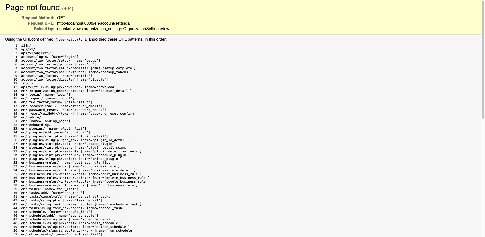

Settings
========

The Settings page shows general information and settings for your organization.
You can configure organization details, set up indemnification, and add tags for categorization.

The settings that can be changed on this page:

- Change organization data (name, code)
- Add or update indemnification
- Add tags to the organization

