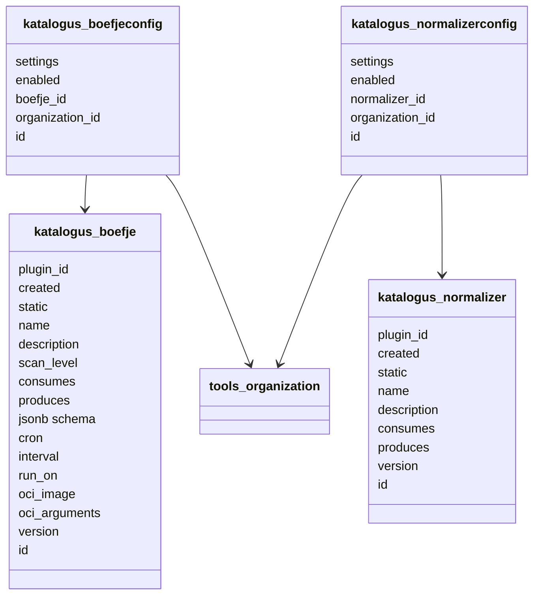
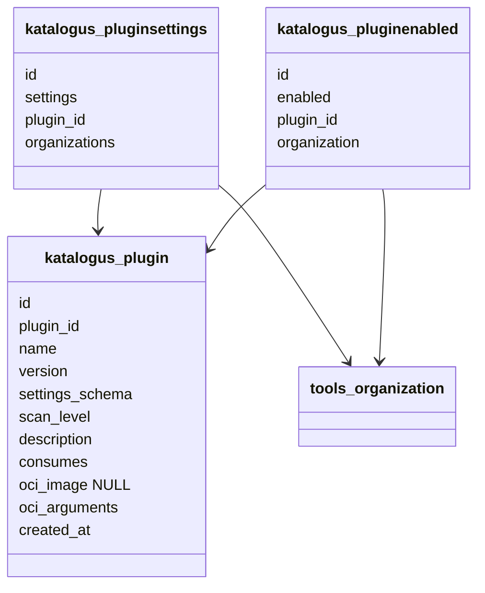
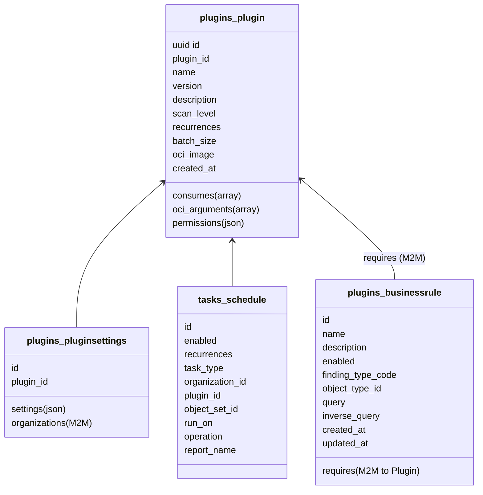

# RFD 0006: The Plugin Database Schema

## Introduction

In light of RFD 0004 (OpenKAT 2.0), one of the components we should revise is the KATalogus database schema. In OpenKAT
V1, the KATalogus is a separate service that keeps track of the plugins that are available.

The current (integrated) model is as follows:

## Proposal

The core of this proposal is to:

1. As per RFD 0004, merge the KATalogus models into the OpenKAT schema.
2. Resolve the long-standing conflict between boefjes and normalizers by merging them into a Plugin model.
3. Make creating your own plugins even simpler by revising the `consumes` vs. `produces` architecture.
4. Improve the plugin configuration setup/definitions.

A discussion around the OCI images is postponed to a subsequent RFD, so those considerations are ignored in this
document.

See the proposed model below:

### Functional Requirements (FR)

With respect to plugin management:

1. Users should be able to enable/disable plugins somehow to prevent them from running on any object.
2. Users should be able to configure plugins (enabled/disabled, settings) per organization, but this should be easy for many organizations as well.
3. Plugin versions should be pinned and easy to manage.
4. Users should be able to trigger plugins on demand for one or more organizations on one or more input oois.
5. Users should be able to schedule plugins periodically for one or more organizations on one or more input oois.

With respect to a discussion about the existence of the boefje-normalizer-bit relationship:

6. We should be able to add "untrusted" plugins from external repositories that we run in a secure way.
7. We need to be able to do attribution of OOIs through plugins properly.
8. Maybe we shouldn't allow all plugins to write models to the database.

### Extensibility (Potential Future Requirements)

#### Related to the Plugins themselves

1. Perhaps plugin configuration should be manageable for a selection of organizations as well.
2. We should be able to import multiple plugins at once from external repositories

#### Related to scanning in general

3. Normalizers should be allowed to run on multiple raw files, perhaps determined by more sophisticated filters
4. One Boefje should be able to run on multiple OOIs
5. One Boefje should be able to run on multiple OOIs of different object_types
6. Normalizers should be able to use other OOIs as input as well
7. Bits should be able to query the database directly arbitrarily (Nibbles use-case partly)
8. Combining RawFiles and OOIs to create Findings should be possible

### A Generic Plugin Model (FR 1,2,3,4,5)

Functional Requirement 1, 2 and 3 can be tackled with the new variant of the original model using the same logic.
We do need to make sure versions are pinned upon creation, something to touch upon for an RFD on the OCI images.

For Functional Requirement 4 and 5, the current model already allows for configuring or scheduling plugins for
arbitrary organizations. For plugins to allow for multiple input oois, we should tackle the plugin interface and
figure out the impact on deletion propagation. Details on a new boefje interface and improvements on the scheduler
will be discussed in separate RFDs. The suggested model is still an MVP in light of these requirements

### Don't we Need Separate Models? Boefjes? Normalizers? (FR 6,7,8)

#### Current limitations

Right now there is a clear separation between boefjes and normalizers:

- Boefjes run on 1 input OOI and produces RawFiles
- Normalizers run on 1 RawFile and produces only OOIs
- Bits run on 1 input OOI, but can have several parameters, and output OOIs

And:

- The output of Normalizers for the same Boefje overwrites the previous output and deletes what hasn't been found
  anymore.
- Boefjes/normalizers run per organization
- Boefjes should run in containers as much as possible because these could run in untrusted environments and/or run
  untrusted code.
- Normalizers conceptually should not have to talk to the internet and are hence "pure functions".

However, these are mostly **implementation details**. Arguments for this split would mostly be about:

- Clear separation of untrusted tasks doing scans versus pure functions parsing data (FR 6).
- The attribution is conceptually always the same (FR 7,8).

But actually, this makes it almost impossible to implement the Extensibility Requirements 3 to 8 currently, or at least
without a lot of work.

In short, the current structure is too rigid, and our old database model does not allow to differ from the structure.
Moreover, this structure makes implementing features such as creating your own scans significantly more work as you
always need to define two tasks (boefje & normalizer).
And the input/outputs are forced into the `OOI --Boefje--> Raw --Normalizer--> OOI`.

#### Why a Generic Plugin Model Also Tackles These Use-cases (And More)

Let's break down why the new simplified model still covers each requirement:

- **FR 6**: This is quite trivial: only plugins that have the `oci_image` field set should run in a container.
- **FR 7**: "Properly" is vague, but if one plugin's Task uses the RawFile of another plugin, this is relatively
  easy to query if you know your SQL: join in the RawFile and its related TaskResults and Task for all tasks and you
  have a tree-like structure on top of your table.
- **FR 8**: Currently we do not have any mechanism to stop boefje output to be parsed, and we are not running
  untrusted boefjes yet, so we might categorize this as a nice-to-have. But it would be straightforward to add a
  boolean field to the current model to mark a plugin as untrusted and require subsequent plugins with more rights
  to parse its output.

Moreover, this would allow us to tackle more of the Extensibility Requirements:

- **Ex 3**: If we allow tasks to pull in arbitrary RawFiles or define multiple RawFiles as their input, this is
  definitely possible as we are not restricted to the old plugin flow.
- **Ex 4**: The same holds for this requirement.
- **Ex 5**: And this one. We should simply update the way the `consumes` field works and improve the boefje signatures.
- **Ex 6**: As long as the attribution is logged properly, because we only look at the output data we don't care
  what sources were used once we fix deletion propagation.
- **Ex 7**: When we move to XTDB 2.0, we can implement a lot of Bits (hopefully) as `UPDATE WHERE` statements doing
  arbitrary operations on the data. Again, not restricting the input but generating a well-defined output makes this
  possible
- **Ex 8**: This would just be a consequence of Ex 3 and 6.

## Implementation

The KATalogus database schema has been implemented according to the proposal with the following design choices and refinements:

### Database Models

The final implementation consists of the following models:

**Key model decisions:**

1. **Plugin Model** (`plugins.models.Plugin`):

**Successfully merged Boefjes and Normalizers** into a single generic Plugin model with new fields:

- `consumes` ArrayField replaces the old separate "consumes" and allows for object types and file types.
- `permissions` a JSONField to declare **and restrict** the required API permissions
- `recurrences` field allows plugins to define default schedule intervals
- `batch_size` define a preferred batch size for the plugin: efficient plugins should prefer a larger object batch.

2. **PluginSettings Model** (`plugins.models.PluginSettings`):

   - Stores JSON-based settings per plugin
   - Uses `ManyToManyField` to `Organization` allowing settings to apply to multiple organizations
   - Replaces the old `BoefjeConfig` and `NormalizerConfig` models

3. **Schedule Model** (`tasks.models.Schedule`):
   - **Replaced the old `EnabledPlugin` model and scheduling logic.**
   - Combines enable/disable state with scheduling configuration
   - Can be organization-specific or global (`organization` field is nullable)
   - Supports multiple schedules per plugin with different recurrence patterns
   - `task_type` field supports both "plugin" and "report" tasks

**Why EnabledPlugin was dropped (aha-moment):**

The original V1 schema had both:

- `EnabledPlugin` with an `enabled` boolean per organization
- Scheduling configuration elsewhere

This created confusion and duplication:

- To enable a plugin: set `EnabledPlugin.enabled = True`
- To schedule a plugin: create a schedule and enabled it; but even with an enabled schedule they did not run unless enabled.

The insight: **why have a separate enabled field on the plugin?**.
Enabling a plugin in v1 meant it was available for the scheduler to pick it up, and users could run them manually.
But the scheduler has been replaced by explicit schedules, and if users are allowed to run plugins manually, they are
probably allowed to enable them as well, so this is just unnecessary clicking.
In short: a schedule _is_ the way to "enable" a plugin for an organization, i.e. running it periodically.

The model became:

- Want to enable a plugin for an org? → Create a Schedule with `enabled=True`
- Want to disable it? → Set `Schedule.enabled=False` or delete the schedule
- Want different recurrence patterns? → Create multiple schedules

This eliminates the confusion of "Is the plugin enabled but not scheduled? Scheduled but not enabled?"
and provides a single source of truth: **If there's an enabled Schedule, the plugin runs. If not, it doesn't.**

This means:

- Simplicity: One model instead of two
- No synchronization issues between "enabled" and "scheduled" state
- Flexibility: multiple schedules per plugin, per organization
- Clearer semantics: a schedule is when and whether to run, and it is the only place/model that decides it.

4. **BusinessRule Model** (`plugins.models.BusinessRule`):
   - Allows conditional execution rules based on object queries
   - `requires` ManyToMany relationship to Plugin allows rules to depend on plugin execution
   - Replaces some "Bit" functionality from V1 with a more declarative approach
   - Can create Findings based on query matches

### Key Implementation Files

| File                | Purpose                                                    |
| ------------------- | ---------------------------------------------------------- |
| `plugins/models.py` | Plugin, PluginSettings, BusinessRule models                |
| `tasks/models.py`   | Schedule model (enables/disables plugins per organization) |
| `plugins/runner.py` | Plugin execution logic with OCI container support          |
| `plugins/views.py`  | Plugin management views with multi-organization support    |

### Functional Requirements Coverage

- **FR 1&2**: Plugin enable/disable and configuration is handled per organization via Schedule and PluginSettings models
- **FR 3**: Plugin versions are pinned in the `version` field
- **FR 4**: Manual plugin triggering is supported via the task creation API
- **FR 5**: Periodic scheduling is supported via `Schedule.recurrences` field
- **FR 6**: Plugins with `oci_image` set run in containers; access control via `permissions` field
- **FR 7**: OOI attribution is tracked via `ObjectTask` model linking tasks to output objects
- **FR 8**: Plugin permissions can be restricted via the `permissions` JSONField

### Migration from V1

The transition from the V1 KATalogus schema involved:

- Merging separate `Boefje` and `Normalizer` models into the generic `Plugin` model
- Consolidating `BoefjeConfig` and `NormalizerConfig` into `PluginSettings`
- Replacing `EnabledPlugin` with the more flexible `Schedule` model
- Moving plugin metadata from separate tables into the unified `Plugin` model
- Containerizing all plugins by default using the `oci_image` and `oci_arguments` fields

This implementation successfully addresses all functional requirements (FR 1-8) and provides a foundation for the extensibility requirements,
particularly allowing plugins to consume multiple input types and run on various object combinations.
